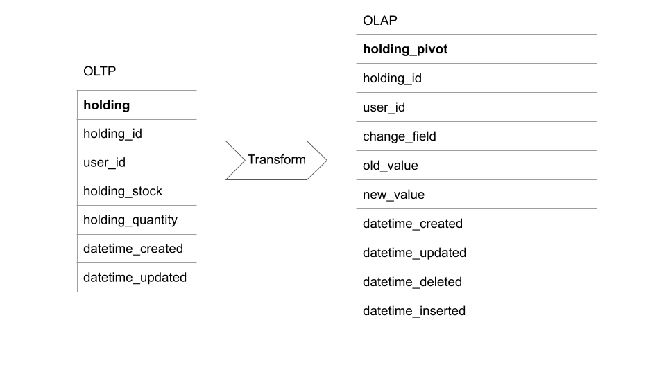
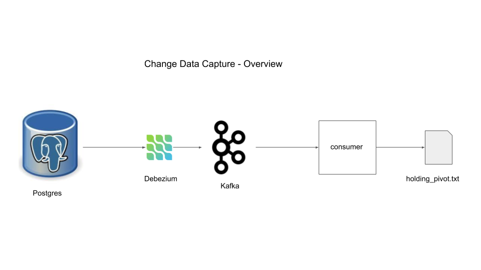
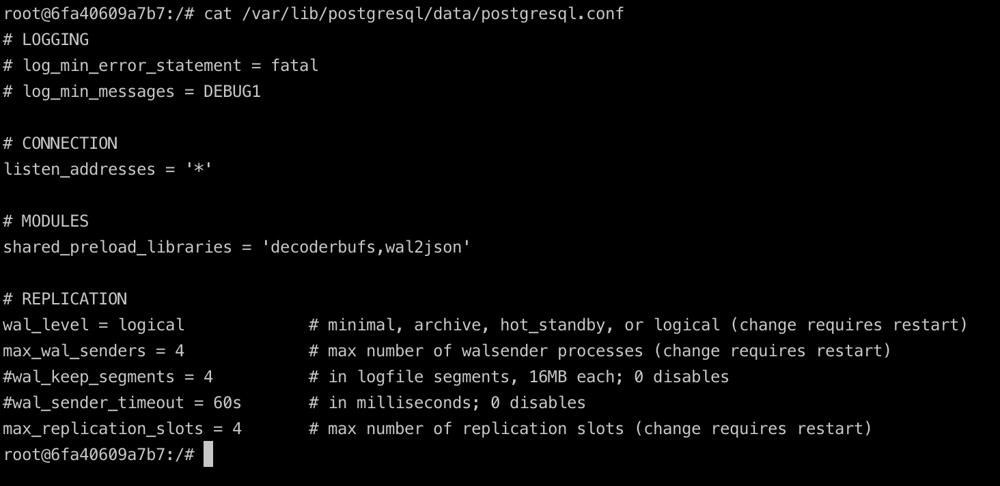
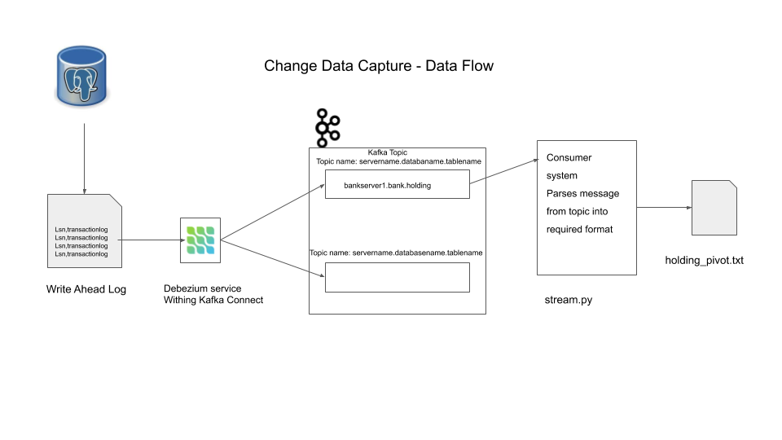

# change-data-catpure-using-Debezium-kafka-Postgres

## Change Data Capture
The CDC is a software design pattern used to capture changes to data and take corresponding action based on that change. The change can be insert, update or delete.

## GOAL
The goal of this project is to create a simple stream processing system to capture changes in data

## Why Change Data Capture
After all to maintain one source of truth to keep changes in application logic. Some of the use cases can be,
  1. Tracking data changed to feed into an Elastic search index
  2. Moving data changes from OLTP to OLAP in real time
  3. Creating audit logs, etc

## Building Data Change Logs
Let's try to understand cdc design pettern using very simple example.

### Problem
Assume we have an application that does simple CRUD (create read update delete) operations on an holding table.

holding table structure,

*holding_id, user_id, holding_stock, holding_quantity, datatime_created, datatime_updated*

and we want to be able to answer questions like,
  1. How many times did a specific user change stock types?
  2. How many times did a specific user change stock quantity?
  3. Between date 1 and 2, what was the most commonly sold stock among all users?
  4. etc...

**without effecting the performance of our application**. Any easy way to do this would be to pivot the table into
*k-v structure* in an OLAP database as *holding_pivot* table

holding_pivot table structure,

*holding_id, user_id, change_field, old_value, new_value, datetime_created, datetime_updated, datetime_deleted, datetime_inserted,crud_type*

From the OLAP table holding_pivot, we can answer the questions above,

1.How many times did a specific user change (also include delete) stock types?

    select count(*) from holding_pivot
    where change_field = 'holding_stock'
      and old_value <> new_value
      and old_value is not null
      and user_id = 'given user id';

2.How many times did a specific user change stock quantity?

    select count(*) from holding_pivot
    where change_field = 'holding_quantity'
      and old_value <> new_value
      and old_value is not null
      and user_id = 'given_user_id';

3.Between date 1 and date 2, what was the most commonly sold stock among all users?

    select old_value from holding_pivot
    where datetime_updated between 'given date 1' and 'given date 2'
      and old_value <> new_value
      and old_value is not null
    group by old_value
    order by count(*) desc
    limit 1;

## Project overview
Let's assume our application uses a *postgres* database for it's datastore with holding table and destination
is a data store which is pivoted holding table which we can store this as simple text file in local machine
for this simple example, this file can be ingested into OLAP target database.

### Design overview

### Components
#### Prereq Installations
1. ***docker*** (preferred) to run ***postgres***, ***debezium*** and ***kafka***
2. ***pgcli*** to connect to ***postgres*** instance

### 1. Postgres
This will serve as application database. To understand how CDC (with ***debezium***) works we need
to understand what happens when a transaction occurs. When a transaction occurs, the transaction is
first logged in a place called Write ahead log (WAL) in the disk and then the data change or update
or delete is processed. The transactions are generally cached and then flushed to disk in bulk to
keep latency low. In case of database crash when transactions are in cache then database can recover
from logs in WAL in disk. Using WAL only logs are written to disk are less expensive than writing
all the database changes to the disk, this is a tradeoff the developers of ***postgres*** had to
make to keep latency of transactions low and have the ability to recover in case of crash.

You can think of WAL as an append only log that contains all the operations in a sequential order
with the timestamp. These WAL files are periodically removed or archived to keep database size low.

use ***docker*** to run ***postgres*** instance

    docker run -d --name postgres --post 5432:5432 -e POSTGRES_USER=data_engineer \
    -e POSTGRES_PASSWORD=password debezium/postgres:12

here we use ***debezium/postgres:12*** image, the reason for using the debezium's docker of postgress
was to enable the settings that postgres requires to operate with debezium. Here are the settings

    docker exec -it postgres /bin/bash

using the above command to execute the /bin/bash command on the postgres container in interactive mode -it.
Now inside the docker container.

    cat /var/lib/postgres/data/postgresql.conf
this will show the configuration settings for postgres.
#### postgresql.conf

The replication section is where we set the configuraiton for the database to write the WAL.

Let's create data in postgres. We use pgcli to interact with postgres instance

    pgcli -h localhost -p 5432 -U data_engineer
    #provide password

Create table and insert a record

    CREATE SCHEMA bank;
    SET search_path TO bank,public;
    CREATE TABLE bank.holding (
      holding_id int,
      user_id int,
      holding_stock varchar(8),
      holding_quantity int,
      datetime_created timestamp,
      datatime_updated timestamp
      );
    ALTER TABLE bank.holding replica identity FULL;
    INSERT INTO bank.holding VALUES (1000, 1, 'VFIAX', 10, now(), now());

in the above, ***replica identity*** can be set as ***DEFAULT***, ***NOTHING***, ***FULL***
and ***INDEX*** which determines the amount of detailed information written to the WAL.
We chose ***FULL*** to get all the before and after data for CRUD change events. ***INDEX***
is same as ***FULL*** but also includes changes made to indexes as well.

### 2. kafka
Kafka is a message queue system with at least once guarentee.
  1. kafka is a *distributed message queue* system. The distributed cluster management is done by *zookeeper*
  2. The *broker* handles consumer write, producer request and metadata config. One server within a kafka
  cluster is one kafka broker, there can be multiple brokers within a single kafka cluster
  3. A *Topic* is a specific queue into which the producers can push data and consumers can read from.
  4. *Partitions* are way to distribute the content of a topic over the cluster.
  5. You can think of *offset* (specific to partition) as the pointer pointing to which message you
  are while reading messages from that topic-partition

  In this project, kafka broker will be used to store data changes being made in the postgres database as
  messages. Consumer will be setup in the later sections.

start *zookeeper* and a *kafka* broker

    docker run -d --name zookeeper -p 2181:2181 -p 2888:2888 -p 3888:3888 debezium/zookeeper:1.1
    docker run -d --name kafka -p 9092:9092 --link zookeeper:zookeeper debezium/kafka:1.1

### 3. Debezium
We use a kafka tool called Connect to run debezium. As the name suggests Connect provides a framework
to connect input data sources to kafka and connect kafka to output sinks. It runs as a separate
service.

Debezium is responsible for reading the data from source data system i.e. postgres and pushing it into
kafka topic (automatically named after the table) in a suitable format.

Start a kafka Connect container

    docker run -d --name connect -p 8083:8083 --link kafka:kafka --link postgres:postgres
    -e BOOTSTRAP_SERVERS=kafka:9092 -e GROUP_ID=sde_group -e CONFIG_STORAGE_TOPIC=sde_storage_topic \
    -e OFFSET_STORAGE_TOPIC=sed_offset_topic debezium/connect:1.1

We can use curl to check if any registered connect services,

    curl -H "Accept:application/json" localhost:8083/connectors/
    []

No registered connectors found, now we can register a debezium connect service using curl to connect
service on port 8083

    curl -i -X POST -H "Accept:application/json" -H "Content-Type:application/json" localhost:8083/connectors/ \
    -d '{"name":"sde-connector", "config": {"connector.class":"io.debezium.connector.postgresql.PostgresConnector",   "database.hostname": "postgres", "database.port": "5432", "database.user": "data_engineer", \
    "database.password": "password", "database.dbname": "data_engineer", "database.server.name": "bankserver1" \
    "table.whitelist": "bank.holding"}}'

here *table.whitelist* is a field that informs the debezium connector to only read data changes from that table.
By default debezium reads from all the tables in the schema.

Now check again presence of connector

    curl -H "Accept:application/json" localhost:8083/connectors/
    ["sde-connector"]%

now we can see sde-connector is registered.

### 4. Consumer
Now that we have our connector pushing in messages into kafka broker, we can consume the messages using
a consumer. Take a look at only the first message in the kafka topic bankserver1.bank.holding using below

    docker run -it --name consumer --link zookeeper:zookeeper --link kafka:kafka debezium:kafka:1.1
    watch-topic -a bankserver1.bank.holding --max-messages 1 | grep '^{'

In the above we start a consumer container to watch the topic bankserver1.bank.holding which follows
the format of *{database.server.name}.{schema}.{table}* and we set the max number of messages to be read
as 1. The grep is to filter out non JSON lines. If you print out some configs (Note: use ***jq***
to format json if you want), it basically has 2 main sections,
1. ***schema***: The schema defines the schema of the payload for *before*, *after*, *source*,
  *crud_type*, *ts_ms* and *transcation* sections.
2. ***payload***: this contains actual data, there are before and after sections showing data changes

We care about the before and after sections. We will use Python to format this into pivot structure.
Refer stream.py file.

Stop the earlier consumer container and remove pod is needed. Now start consumer container as below,

    docker run -it --name consumer --link zookeeper:zookeeper --link kafka:kafka debezium/kafka:1.1 \
    watch-topic -a bankserver1.bank.holding | grep --line-buffered '^{' | stream.py > holding-pivot.txt

*grep* to allow only line starts with { denoting json, the *--line-buffered* option tells grep to
ouptput one line at a time without buffering and then use the python script to transform the message
into a format we want and write the output to a file called *holding-pivot.txt*.

In another terminal just tail the pivot file to follow along to see if any new lines added,

    tail -f <file-path>/holding-pivot.txt

In another terminal open a connection to postgres instance using pgcli,

    pbcli -h localhost -p 5432 -U data_engineer
    #provide password when prompted

Type the following sql scripts and make sure the output is streamed into holding-pivot.txt is accurate,

    -- C
    insert into bank.holding values (1001, 2, 'SP500', 1, now(), now());
    insert into bank.holding values (1002, 3, 'SP500', 1, now(), now());

    -- U
    update bank.holding set holding_quantity = 100 where holding_id = 1000;

    -- D
    delete from bank.holding where user_id = 3;
    delete from bank.holding where user_id = 2;

    -- C
    insert into bank.holding values (1003, 3, 'VTSAX', 100, now(), now());

    -- U
    update bank.holding set holding_quantity = 10 where holding_id=1003;

## Data Flow
This represents how we use CDC pattern to capture changes from database application, transform into
a different format without having an impact on the application performance or memory.
### Design Data Flow

### Stop Docker containers

    docker stop <container-name> # to stop specific container
    docker rm <container-name>   # to remove specific container

    docker stop $(docker ps -aq) # to stop all running containers
    docker rm $(docker ps -aq)   # to remove all containers

## Things to be aware of

1. This sample project is to capture data changes only but not schema changes
2. WAL configurations need to be set carefully to prevent overloading the database
3. As with the most distributed systems, there are multiple points of failure, for e.g. the
  database could crash, kafka cluster could crash, or consumer container could crash, etc.
  Always plan for failures and have recovery mechanism to handle these issues.
4. Both kafka and debezium offers atleast once even delivery mechanism. This is good but
  consumer or user have to be designed to deal with duplicates. A good approach could be
  to use upsert based data ingestion on the consumer side.
